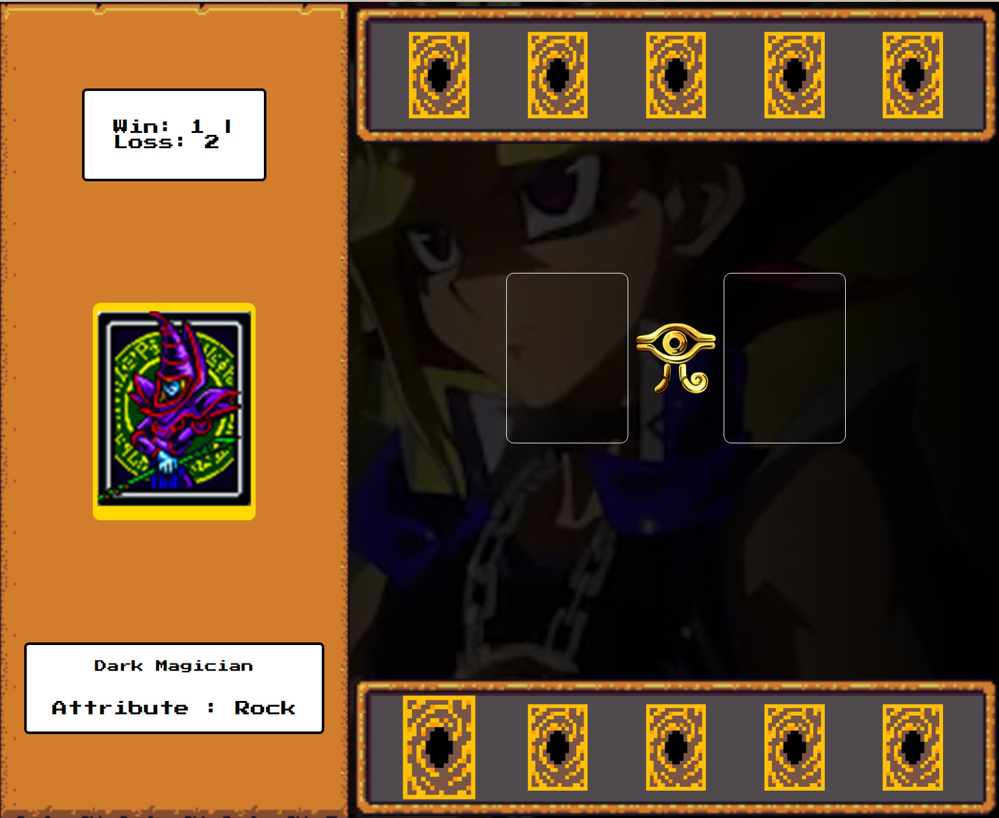

# Yu-Gi-Oh! Jo-Ken-Po Edition

<div align="center">




**Jogo de cartas inspirado no Yu-Gi-Oh! com mecânica de pedra, papel e tesoura**

[](https://anathiare.github.io/DesafiosDIOBootcamp/gameYuGiOh/)
[](https://github.com/anathiare/DesafiosDIOBootcamp/tree/main/gameYuGiOh)

</div>

---

## Sobre o Projeto

Jogo de cartas inspirado no universo Yu-Gi-Oh! que utiliza a mecânica clássica de **pedra, papel e tesoura**. Desenvolvido com **JavaScript puro** e **CSS**, oferece uma experiência interativa e divertida com sistema de pontuação, animações e trilha sonora temática.

### ✨ Funcionalidades
- **🎮 Sistema de Duelo:** Mecânica de pedra, papel e tesoura com cartas
- ** Pontuação Dinâmica:** Contador de vitórias e derrotas
- ** Trilha Sonora:** Música temática do Yu-Gi-Oh!
- **✨ Animações CSS:** Efeitos visuais e transições
- **📱 Design Responsivo:** Funciona em diferentes dispositivos
- ** Cartas Interativas:** Seleção e visualização de cartas

---

## 🚀 Como Jogar

**Acesse diretamente:** [https://anathiare.github.io/DesafiosDIOBootcamp/gameYuGiOh/](https://anathiare.github.io/DesafiosDIOBootcamp/gameYuGiOh/)

### Instruções do Jogo
1. **Selecione uma carta** do seu deck (5 cartas disponíveis)
2. **O computador escolhe** automaticamente sua carta
3. **O duelo acontece** seguindo as regras de pedra, papel e tesoura:
   - **Pedra (Rock)** vence Tesoura (Scissors)
   - **Papel (Paper)** vence Pedra (Rock)
   - **Tesoura (Scissors)** vence Papel (Paper)
4. **A pontuação é atualizada** após cada duelo
5. **Clique em "Next Duel"** para jogar novamente

---

##️ Tecnologias

- **HTML5:** Estruturação semântica
- **CSS3:** Animações, Flexbox e design responsivo
- **JavaScript:** Lógica de jogo e manipulação do DOM
- **Audio API:** Reprodução de trilha sonora

## 🎨 Conceitos Abordados

### 💻 **Lógica de Programação**
- **Gerenciamento de Estado:** Controle manual do estado do jogo
- **Funções Limpas:** Código organizado e reutilizável
- **Estruturas de Dados:** Arrays e objetos para cartas
- **Algoritmos:** Lógica de vitória/derrota

### 🎮 **Desenvolvimento de Jogos**
- **Sistema de Pontuação:** Controle de vitórias e derrotas
- **Interface de Usuário:** Design interativo e responsivo
- **Feedback Visual:** Animações e transições
- **Audio Integration:** Trilha sonora e efeitos

###  **Organização de Código**
- **Separação de Responsabilidades:** CSS, JS e HTML organizados
- **Nomenclatura Clara:** Variáveis e funções bem nomeadas
- **Comentários:** Código documentado
- **Estrutura Modular:** Arquivos separados por função

---

##  Trilha Sonora

O jogo inclui:
- **Música de fundo:** Tema do Yu-Gi-Oh! (egyptian_duel.mp3)
- **Efeitos sonoros:** Sons de vitória e derrota
- **Controle de volume:** Ajuste automático para melhor experiência

---

##  Design

### 🎭 **Tema Visual**
- **Estilo RPG:** Interface inspirada em jogos de cartas
- **Cores Temáticas:** Dourado e azul do universo Yu-Gi-Oh!
- **Tipografia:** Fonte "Press Start 2P" para nostalgia
- **Elementos Visuais:** Frames dourados e efeitos especiais

### 📱 **Responsividade**
- **Mobile First:** Design adaptável para diferentes telas
- **Flexbox/Grid:** Layout moderno e flexível
- **Media Queries:** Adaptação para tablets e desktops

---


<div align="center">

**🎮 Divirta-se jogando! 🎮**

</div>

## 📁 Estrutura

```
gameYuGiOh/
├── src/
│   ├── assets/
│   │   ├── audios/           # Trilha sonora e efeitos
│   │   ├── cursor/           # Cursores personalizados
│   │   ├── favicon/          # Ícones do site
│   │   ├── icons/            # Imagens das cartas
│   │   ├── rpg/              # Elementos visuais RPG
│   │   └── video/            # Vídeo de fundo
│   ├── scripts/
│   │   └── engine.js         # Lógica principal do jogo
│   └── styles/
│       ├── buttons.css       # Estilos dos botões
│       ├── containers_and_frames.css  # Layout e frames
│       ├── main.css          # Estilos principais
│       └── reset.css         # Reset CSS
├── index.html                # Página principal
├── capa.png                  # Imagem de capa do projeto
├── readme.md                 # Este arquivo
└── .cursorrules              # Configurações do editor
```
```